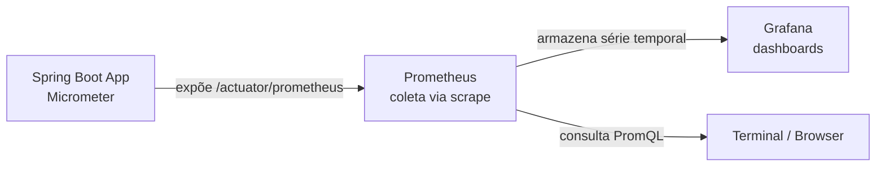

# observability-demo

Projeto de estudo prático de **observabilidade em aplicações Java/Spring Boot**, construído para consolidar conceitos de métricas, monitoramento e instrumentação de código — do ponto de vista de quem desenvolve a aplicação, não de quem administra a ferramenta de monitoramento.

## Visão geral

A aplicação expõe métricas de negócio e de infraestrutura (JVM) através do **Spring Boot Actuator** e do **Micrometer**, que são coletadas por um **Prometheus** e visualizadas em dashboards no **Grafana** — o par de ferramentas mais adotado hoje no mercado para observabilidade de aplicações Java.

## Arquitetura



- **Aplicação**: expõe as métricas, não coleta nem armazena nada sozinha.
- **Prometheus**: periodicamente "puxa" (*scrape*) os dados do endpoint da aplicação e os guarda como série temporal.
- **Grafana**: lê o Prometheus como fonte de dados e monta os dashboards visuais.

## Stack técnica

| Camada | Tecnologia |
|---|---|
| Linguagem / Framework | Java 17+, Spring Boot 3.3 |
| Instrumentação | Spring Boot Actuator, Micrometer |
| Coleta de métricas | Prometheus |
| Visualização | Grafana |
| Empacotamento da infra | Docker Compose |

## Como rodar

**Pré-requisitos:** Java 17+, Maven, Docker Desktop.

**1. Subir a aplicação:**
```bash
mvn org.springframework.boot:spring-boot-maven-plugin:3.3.4:run
```
Aplicação disponível em `http://localhost:8080`.

**2. Subir Prometheus + Grafana:**
```bash
cd observability-stack
docker compose up -d
```

| Serviço | URL | Credenciais |
|---|---|---|
| Aplicação | http://localhost:8080 | — |
| Prometheus | http://localhost:9090 | — |
| Grafana | http://localhost:3000 | admin / admin |

## Endpoints de negócio (geram métricas customizadas)

| Endpoint | Descrição | Métrica gerada |
|---|---|---|
| `GET /hello?nome=Andre` | Saudação simples | `app.hello.requests` (Counter) |
| `GET /slow` | Simula operação lenta | `app.slow.duration` (Timer) |

## Endpoints de observabilidade (Actuator)

| Endpoint | Descrição |
|---|---|
| `/actuator/health` | Status de saúde da aplicação, com detalhes de componentes |
| `/actuator/metrics` | Lista de todas as métricas disponíveis |
| `/actuator/prometheus` | Métricas no formato que o Prometheus consome |

## Estrutura do projeto

```
observability-demo/
├── src/main/java/com/example/observabilitydemo/
│   ├── ObservabilityDemoApplication.java
│   └── DemoController.java          # métricas customizadas (Counter, Timer)
├── src/main/resources/
│   └── application.properties        # configuração do Actuator/Micrometer
├── observability-stack/
│   ├── docker-compose.yml            # Prometheus + Grafana
│   └── prometheus.yml                # configuração de scrape
├── pom.xml
└── README.md
```

## Conceitos demonstrados

- **Instrumentação de código**: como uma aplicação expõe dados para serem consumidos por ferramentas externas, via métricas customizadas (`Counter`, `Timer`) e automáticas (JVM, heap, threads).
- **Modelo *pull* de coleta**: o Prometheus é quem inicia a coleta, puxando dados periodicamente — diferente do modelo *push*, onde a aplicação envia os dados ativamente (explorado em paralelo num laboratório com Zabbix Agent).
- **PromQL**: consulta a séries temporais coletadas (ex: `process_uptime_seconds`).
- **Separação de responsabilidades**: a aplicação só expõe dado; quem decide o que alertar e como visualizar fica nas ferramentas de observabilidade, não no código de negócio.

## Roadmap do estudo

- [x] Instrumentação com Actuator + Micrometer
- [x] Integração com Prometheus + Grafana
- [ ] Logging estruturado (JSON) e Correlation ID
- [ ] Health checks customizados (liveness/readiness)
- [ ] Distributed tracing com OpenTelemetry
- [ ] Vocabulário e práticas de SRE (SLI/SLO/SLA)

## Autor

André Muniz — projeto de estudo para aprofundamento em observabilidade e preparação para entrevistas técnicas na área de desenvolvimento Java.