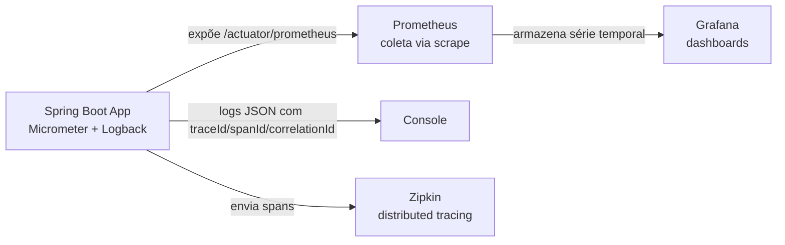

# observability-demo
### André Muniz

Projeto de estudo prático de **observabilidade em aplicações Java/Spring Boot**, construído para consolidar conceitos de métricas, logs, tracing e monitoramento — do ponto de vista de quem desenvolve a aplicação, não de quem administra a ferramenta de monitoramento. Feito como preparação para entrevistas técnicas na área.

## Visão geral

A aplicação expõe métricas de negócio e de infraestrutura (JVM) através do **Spring Boot Actuator** e do **Micrometer**, coletadas pelo **Prometheus** e visualizadas em dashboards no **Grafana**. Produz **logs estruturados em JSON** e participa de **distributed tracing** via **Micrometer Tracing + OpenTelemetry**, com os traces enviados ao **Zipkin**. O diferencial do projeto é a **correlação entre logs e traces**: cada linha de log carrega o `traceId`/`spanId` do span em andamento, além de um `correlationId` próprio — permitindo pular de um log de erro direto para o trace completo daquela requisição.

## Arquitetura



- **Aplicação**: expõe métricas, produz logs estruturados e gera spans de tracing; não coleta nem armazena nada sozinha.
- **Prometheus**: periodicamente "puxa" (*scrape*) os dados do endpoint da aplicação e os guarda como série temporal.
- **Grafana**: lê o Prometheus como fonte de dados e monta os dashboards visuais.
- **Zipkin**: recebe os spans via Micrometer Tracing (bridge OTel) e reconstrói a árvore de chamadas de cada requisição.
- **Logback**: formata cada linha de log como JSON, incluindo `traceId`, `spanId` e `correlationId`.

## Stack técnica

| Camada | Tecnologia |
|---|---|
| Linguagem / Framework | Java 17+, Spring Boot 3.3.4 |
| Instrumentação (métricas) | Spring Boot Actuator, Micrometer |
| Logging estruturado | Logback + Logstash Encoder (JSON) |
| Distributed tracing | Micrometer Tracing + OpenTelemetry bridge + Zipkin |
| Health checks | Spring Boot Actuator (liveness/readiness + indicator customizado) |
| Coleta de métricas | Prometheus |
| Visualização | Grafana |
| Empacotamento da infra | Docker Compose |

## Como rodar

**Pré-requisitos:** Java 17+, Maven, Docker Desktop.

**1. Subir a aplicação:**
```bash
mvn org.springframework.boot:spring-boot-maven-plugin:3.3.4:run
```
> Não usar `mvn spring-boot:run` — dá erro de prefixo de plugin nesse ambiente.

Aplicação disponível em `http://localhost:8080`.

**2. Subir Prometheus + Grafana + Zipkin:**
```bash
cd observability-stack
docker compose up -d
```

| Serviço | URL | Credenciais |
|---|---|---|
| Aplicação | http://localhost:8080 | — |
| Prometheus | http://localhost:9090 | — |
| Grafana | http://localhost:3000 | admin / admin |
| Zipkin | http://localhost:9411 | — |

## Endpoints de negócio

| Endpoint | Descrição | Métrica gerada |
|---|---|---|
| `GET /hello?nome=Andre` | Saudação simples | `app.hello.requests` (Counter) |
| `GET /slow` | Simula operação lenta (até 500ms) | `app.slow.duration` (Timer) |

Todo endpoint produz logs estruturados em JSON com `traceId`, `spanId` (do span do Micrometer Tracing) e `correlationId` (reaproveitado do header `X-Correlation-Id` se o cliente enviar, ou gerado automaticamente).

## Endpoints de observabilidade (Actuator)

| Endpoint | Descrição |
|---|---|
| `/actuator/health` | Status de saúde da aplicação, com detalhes de componentes — inclui o `paymentService` (health indicator customizado, simula dependência externa) |
| `/actuator/health/liveness` | Probe de liveness (padrão Kubernetes) |
| `/actuator/health/readiness` | Probe de readiness (padrão Kubernetes) |
| `/actuator/metrics` | Lista de todas as métricas disponíveis (negócio + JVM) |
| `/actuator/prometheus` | Métricas no formato que o Prometheus consome |

## Verificando o tracing e a correlação

```bash
# 1. Gera uma requisição
curl http://localhost:8080/hello?nome=teste

# 2. Confirma que o trace chegou no Zipkin
curl http://localhost:9411/api/v2/traces

# 3. Compara o traceId do log da aplicação com o traceId retornado pelo Zipkin
#    — devem ser o mesmo valor (mesma requisição).
```

## Estrutura do projeto

```
observability-demo/
├── src/main/java/com/amztec/observabilitydemo/
│   ├── ObservabilityDemoApplication.java
│   ├── DemoController.java                 # endpoints + métricas customizadas
│   ├── CorrelationIdFilter.java            # correlationId + traceId/spanId no MDC
│   ├── FilterConfig.java                   # registra o filtro após o tracing iniciar o span
│   └── PaymentServiceHealthIndicator.java  # health indicator customizado
├── src/main/resources/
│   ├── application.properties              # Actuator, Micrometer, Zipkin
│   └── logback-spring.xml                  # logs em JSON (correlationId/traceId/spanId)
├── observability-stack/
│   ├── docker-compose.yml                  # Prometheus + Grafana + Zipkin
│   └── prometheus.yml                      # configuração de scrape
├── pom.xml
└── README.md
```

## Conceitos demonstrados

- **Instrumentação de código**: como uma aplicação expõe dados para ferramentas externas, via métricas customizadas (`Counter`, `Timer`) e automáticas (JVM, heap, threads).
- **Modelo *pull* de coleta**: o Prometheus inicia a coleta, puxando dados periodicamente — diferente do modelo *push* (explorado em paralelo num laboratório com Zabbix Agent).
- **PromQL**: consulta a séries temporais coletadas (ex: `process_uptime_seconds`).
- **Logging estruturado (JSON)**: logs pensados para serem lidos por máquina/ferramenta de busca, não só por humano.
- **Correlação logs ↔ traces**: `traceId`/`spanId` do Micrometer Tracing propagados para o MDC do SLF4J, permitindo ir do log direto ao trace no Zipkin. Exigiu ordenar o filtro customizado (`FilterRegistrationBean` com `LOWEST_PRECEDENCE`) para rodar *depois* do filtro de tracing do Spring Boot, e listar explicitamente `traceId`/`spanId` no `includeMdcKeyName` do encoder — por padrão o encoder só publica as chaves do MDC citadas ali.
- **Distributed tracing**: cada requisição gera um span, visualizável na árvore de chamadas do Zipkin.
- **Health checks customizados**: um `HealthIndicator` próprio (`PaymentServiceHealthIndicator`) simulando o status de uma dependência externa, mais os probes padrão de liveness/readiness para orquestradores como Kubernetes.
- **Separação de responsabilidades**: a aplicação só expõe dado; quem decide o que alertar e como visualizar fica nas ferramentas de observabilidade.
- **Vocabulário de SRE**:
  - **SLI** (indicador medido, ex: latência p99, taxa de erro), **SLO** (meta interna sobre o SLI, ex: 99% < 300ms) e **SLA** (contrato externo com consequência, ex: 99.5% uptime com penalidade) — cada nível se apoia no anterior.
  - **4 sinais de ouro**: latência, tráfego, erros e saturação (CPU/memória/pool de conexões) — a saturação costuma ser o sinal mais esquecido, mas é o que antecipa problemas antes de virarem sintoma visível.

## Roadmap do estudo

- [x] Instrumentação com Actuator + Micrometer
- [x] Integração com Prometheus + Grafana
- [x] Logging estruturado (JSON) e Correlation ID
- [x] Health checks customizados (liveness/readiness)
- [x] Distributed tracing com Micrometer Tracing + OpenTelemetry + Zipkin
- [x] Correlação logs ↔ traces (traceId/spanId no MDC)
- [x] Vocabulário e práticas de SRE (SLI/SLO/SLA, 4 sinais de ouro)
- [ ] Consolidação final do estudo

## Autor

André Muniz — projeto de estudo para aprofundamento em observabilidade e preparação para entrevistas técnicas na área de desenvolvimento Java.